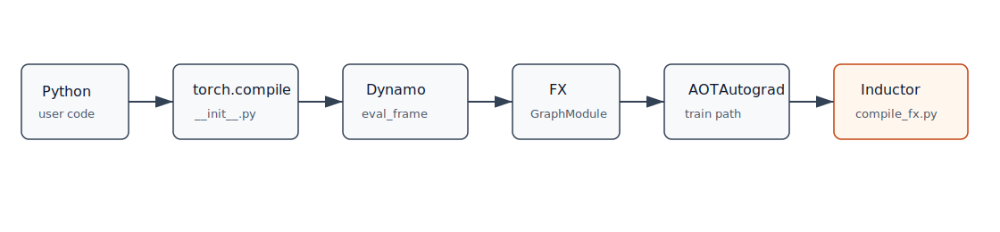

# 第 3 章：`torch.compile` 的入口与参数



## 本章目标

本章从本环境 PyTorch 2.7.1 的源码入口开始，解释 `torch.compile` 做了什么、不做什么，以及几个关键参数如何影响后续调用链。

## 背景知识

用户通常这样使用：

```python
compiled_f = torch.compile(f)
out = compiled_f(x)
```

这看起来像“把函数编译掉”。但源码里，`torch.compile` 更像是一个包装器：它选择 backend，配置 Dynamo，然后返回一个被 Dynamo 接管调用过程的新函数。

## 核心概念

### 默认 backend

在本环境的 `/usr/local/lib/python3.11/site-packages/torch/__init__.py` 中，`torch.compile` 的默认参数是：

```python
backend="inductor"
```

当 backend 是 `"inductor"` 时，源码会构造 `_TorchCompileInductorWrapper`。它的 `__call__` 最终会导入：

```python
from torch._inductor.compile_fx import compile_fx
```

然后调用：

```python
compile_fx(model_, inputs_, config_patches=self.config)
```

这说明用户看到的 `backend="inductor"` 最终会落到 Inductor 的 `compile_fx.py`。

### `fullgraph`

`fullgraph=False` 是默认行为。Dynamo 会尝试发现函数中的可编译区域；遇到不能捕获的部分，可以发生 graph break。

`fullgraph=True` 要求整个函数都可捕获。如果发生 graph break，通常会直接报错。它非常适合定位“为什么这里不能编译”，但不一定适合宽松运行真实模型。

### `dynamic`

`dynamic` 控制动态 shape 策略：

- `False`：倾向于对输入形状专门化。
- `True`：尽量生成更动态的 kernel。
- `None`：默认策略，先专门化，遇到变化后可能转向动态。

在源码文档中，shape 变化可能导致 guard failure 和重新编译。调试相关问题可以使用：

```bash
TORCH_LOGS=dynamic,recompiles python your_script.py
```

### `mode` 和 `options`

`mode` 是预设配置，例如：

- `default`
- `reduce-overhead`
- `max-autotune`
- `max-autotune-no-cudagraphs`

源码注释提示，可用：

```python
import torch
print(torch._inductor.list_mode_options())
```

查看 mode 对应配置。

`options` 是更细粒度的 backend 配置。源码中 `torch.compile` 明确要求 `mode` 和 `options` 不能同时指定。

## 一个最小 PyTorch 示例

```python
import torch

def f(x):
    return torch.sin(x) + torch.cos(x)

x = torch.randn(1024)

compiled_default = torch.compile(f)
compiled_full = torch.compile(f, fullgraph=True)
compiled_dynamic = torch.compile(f, dynamic=True)

print(compiled_default(x))
print(compiled_full(x))
print(compiled_dynamic(x))
```

如果函数足够简单，三者都能运行；区别体现在捕获策略、guard 和重新编译行为上。

## 编译前后发生了什么

`torch.compile(f)` 本身通常不会立刻编译所有东西。真正的捕获和编译发生在第一次调用 compiled function 时。

源码上的关键流程是：

```text
torch.compile(...)
  -> 选择 backend wrapper
  -> torch._dynamo.optimize(...)(model)
  -> 返回被 Dynamo 包装后的 callable
  -> 第一次调用时 Dynamo 捕获 frame
  -> backend 收到 FX GraphModule 和 example_inputs
  -> Inductor compile_fx
```

## TorchInductor 内部大致发生了什么

`_TorchCompileInductorWrapper` 主要做三件事：

1. 收集 `mode` 和 `options` 对应的 Inductor config patch。
2. 对 `triton.cudagraphs` 等特殊配置做环境准备。
3. 在被 Dynamo 调用时，把 `GraphModule` 和输入交给 `compile_fx`。

它不是 Inductor 编译主逻辑，真正主逻辑在 `torch/_inductor/compile_fx.py`。

## 关键源码入口

本环境源码位置：

```text
/usr/local/lib/python3.11/site-packages/torch/__init__.py
/usr/local/lib/python3.11/site-packages/torch/_dynamo/eval_frame.py
/usr/local/lib/python3.11/site-packages/torch/_dynamo/backends/inductor.py
/usr/local/lib/python3.11/site-packages/torch/_inductor/compile_fx.py
```

建议搜索：

```bash
rg -n "def compile\\(|class _TorchCompileInductorWrapper" torch/__init__.py
rg -n "def inductor" torch/_dynamo/backends/inductor.py
rg -n "def compile_fx" torch/_inductor/compile_fx.py
```

## 常见误区

### `torch.compile` 调用时就完成编译

通常不是。第一次实际运行才触发捕获和编译。

### `backend="inductor"` 绕过 Dynamo

不是。默认使用路径仍是 Dynamo 捕获图，然后 backend 编译图。

### `dynamic=True` 一定更快

不一定。动态 shape 能减少某些重编译，但也可能限制优化空间。

## 小结

`torch.compile` 是用户入口；Dynamo 是捕获机制；Inductor 是默认后端。理解这个入口后，阅读源码就有了第一条主线：`torch/__init__.py -> torch._dynamo.optimize -> compile_fx.py`。

## 思考题或练习

1. 调用 `torch._dynamo.list_backends(None)` 看看本环境有哪些 backend。
2. 尝试 `fullgraph=True` 编译一个包含 `print` 的函数，观察报错。
3. 用 `TORCH_LOGS=recompiles` 观察不同输入 shape 是否触发重新编译。

## 本章需要人工核查的技术点

- 本书基于 PyTorch 2.7.1 源码核查。未来版本中 `mode`、`options` 和默认 backend 可能变化。
- `reduce-overhead` 和 CUDA graphs 的适用条件应以当前源码和官方文档为准。

