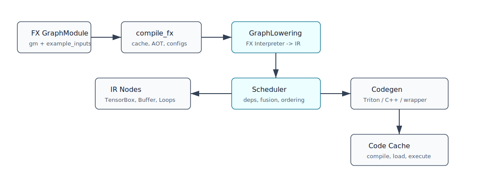

# 第 7 章：`compile_fx.py`：Inductor 编译入口



## 本章目标

本章正式进入 Inductor。我们以本环境 PyTorch 2.7.1 的 `torch/_inductor/compile_fx.py` 为准，解释 `compile_fx`、`compile_fx_inner` 和 `fx_codegen_and_compile` 的职责分工。

## 背景知识

从用户角度看：

```python
compiled_f = torch.compile(f)
compiled_f(x)
```

从 Inductor 角度看，backend 最终收到：

```python
compile_fx(gm, example_inputs)
```

`gm` 是 FX `GraphModule`，`example_inputs` 是示例输入。后续所有 Inductor 优化都围绕这两个对象展开。

## 核心概念

### `compile_fx`

本环境中 `compile_fx` 的源码注释说明：它是编译给定 FX graph 的主入口，并负责调用 AOTAutograd。它还会处理：

- `config_patches`
- C++ wrapper 递归配置
- decomposition
- inference/training 区分
- 调用 `inner_compile`

因此，`compile_fx` 是“端到端编译编排入口”。

### `compile_fx_inner`

`compile_fx_inner` 编译单张图。它会建立一组上下文：

- 禁用当前 Python dispatch modes。
- 使用 lazy graph module 设置。
- 打开 `DebugContext`。
- 创建 fresh cache 上下文。
- 包装 debug/minifier 逻辑。

然后进入 `_compile_fx_inner`。

### `_compile_fx_inner`

`_compile_fx_inner` 更接近 Inductor 真正图编译：

- 检查图是否有 call。
- 准备 static input idxs。
- 处理 cudagraphs 选项。
- 保存 compile args，若启用。
- 处理 FX graph cache。
- cache miss 时调用 `fx_codegen_and_compile`。

### `fx_codegen_and_compile`

本环境中，它根据 `FxCompileMode` 选择编译方案：

- normal：进程内编译。
- serialize：debug serde 编译。
- subprocess：子进程编译。

默认主线会进入 in-process codegen，然后创建 `GraphLowering` 并生成代码。

## 一个最小 PyTorch 示例

```python
import torch

def f(x, y):
    return torch.relu(x + y) * 2

x = torch.randn(128, 128)
y = torch.randn(128, 128)

compiled_f = torch.compile(f, backend="inductor")
print(compiled_f(x, y))
```

调试入口：

```bash
TORCH_LOGS=output_code python example.py
```

或：

```bash
TORCH_COMPILE_DEBUG=1 python example.py
```

## 编译前后发生了什么

在 `compile_fx.py` 中可以把过程理解成：

```text
compile_fx
  -> 处理 config patch / AOTAutograd / decomposition
  -> compile_fx_inner
     -> DebugContext / fresh cache / timing
     -> _compile_fx_inner
        -> FX graph cache lookup
        -> fx_codegen_and_compile
           -> GraphLowering
           -> codegen
           -> code cache load
```

`compile_fx` 是 orchestration；`GraphLowering` 才开始把 FX 节点变成 Inductor IR。

## TorchInductor 内部大致发生了什么

以 `f(x, y) = relu(x + y) * 2` 为例：

1. `compile_fx` 收到 FX GraphModule。
2. AOTAutograd 路径判断这是 inference 或 forward graph。
3. `compile_fx_inner` 建立 debug 和 cache 上下文。
4. `_compile_fx_inner` 查看 FX graph cache 是否命中。
5. cache miss 时进入 codegen。
6. GraphLowering 遍历节点并 lowering。
7. Scheduler 融合 pointwise op。
8. Codegen 生成 wrapper 和 kernel。
9. CodeCache 编译/加载 Python module。

## 关键源码入口

```text
/usr/local/lib/python3.11/site-packages/torch/_inductor/compile_fx.py
/usr/local/lib/python3.11/site-packages/torch/_inductor/graph.py
/usr/local/lib/python3.11/site-packages/torch/_inductor/output_code.py
/usr/local/lib/python3.11/site-packages/torch/_inductor/codecache.py
/usr/local/lib/python3.11/site-packages/torch/_inductor/debug.py
```

建议搜索：

```bash
rg -n "def compile_fx|def compile_fx_inner|def fx_codegen_and_compile" torch/_inductor/compile_fx.py
rg -n "class GraphLowering|def compile_to_module|def codegen" torch/_inductor/graph.py
```

## 常见误区

### `compile_fx.py` 只负责 Inductor，不管 AOTAutograd

本环境源码注释明确说明，`compile_fx` 负责调用 AOTAutograd，并最终回调 `inner_compile`。

### cache 命中时还会重新 codegen

通常不会。FX graph cache 设计目的就是避免重复生成/编译等成本。

### output code 就只有 Triton kernel

不是。输出代码通常包含 Python wrapper、异步编译对象、kernel 调用、内存分配、device guard、assert 等。

## 小结

`compile_fx.py` 是 Inductor 的门厅：它处理配置、AOTAutograd、debug、cache 和 codegen 分发。真正把图变成 IR 的工作从 `GraphLowering` 开始。下一章深入 `graph.py` 和 `ir.py`。

## 思考题或练习

1. 用 `TORCH_LOGS=output_code` 查看一个 pointwise 函数的生成代码。
2. 用 `TORCH_COMPILE_DEBUG=1` 查看 debug 目录结构。
3. 搜索 `compile_fx.py` 中的 `FxGraphCache`，理解 cache lookup 和 miss 分支。

## 本章需要人工核查的技术点

- `FxCompileMode` 默认值和子进程编译行为可能随版本变化。
- remote cache、bundle Triton、AOTInductor 路径本章只做入门介绍，后续需要单独核查。

