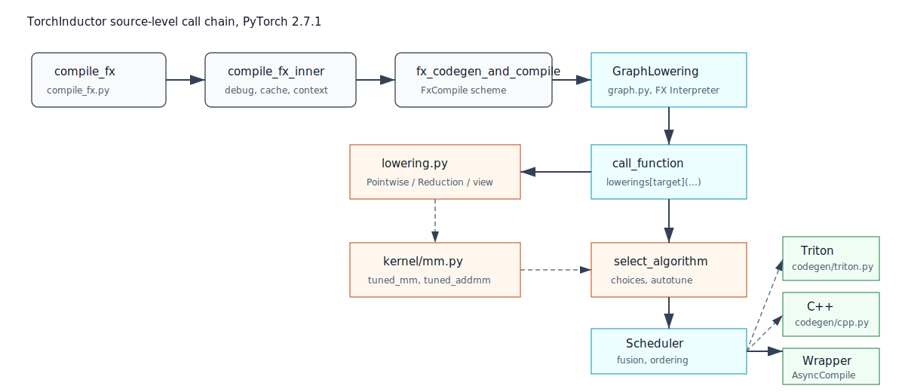

# 第 7 章：`compile_fx.py`：Inductor 编译入口




## 本章目标

本章正式进入 Inductor。我们以本环境 PyTorch 2.7.1 的 `torch/_inductor/compile_fx.py` 为准，解释 `compile_fx`、`compile_fx_inner` 和 `fx_codegen_and_compile` 的职责分工。

从本章开始到第 12 章，我们不再按“概念列表”来理解 Inductor，而是顺着源码调用链阅读：

```text
compile_fx
  -> compile_fx_inner
  -> _compile_fx_inner
  -> fx_codegen_and_compile
  -> _InProcessFxCompile.codegen_and_compile
  -> GraphLowering(...)
  -> graph.run(...)
  -> graph.compile_to_module().call
```

这一章的重点是弄清楚：Inductor 编译入口接收什么、预处理什么、何时进入 `GraphLowering`。

## 背景知识

从用户角度看：

```python
compiled_f = torch.compile(f)
compiled_f(x)
```

从 Inductor 角度看，backend 最终收到：

```python
compile_fx(gm, example_inputs)
```

`gm` 是 FX `GraphModule`，`example_inputs` 是示例输入。后续所有 Inductor 优化都围绕这两个对象展开。

## 核心概念

### `compile_fx`

本环境中 `compile_fx` 的源码注释说明：它是编译给定 FX graph 的主入口，并负责调用 AOTAutograd。它还会处理：

- `config_patches`
- C++ wrapper 递归配置
- decomposition
- inference/training 区分
- 调用 `inner_compile`

因此，`compile_fx` 是“端到端编译编排入口”。

源码定位：

```text
/usr/local/lib/python3.11/site-packages/torch/_inductor/compile_fx.py
  compile_fx: 约 1706 行
```

阅读时注意它的文档字符串：这个函数虽然在 `torch._inductor` 下，但它会编排 AOTAutograd，再让 `inner_compile` 编译单张图。换句话说，`compile_fx` 是 backend 入口，不只是“生成代码”的函数。

### `compile_fx_inner`

`compile_fx_inner` 编译单张图。它会建立一组上下文：

- 禁用当前 Python dispatch modes。
- 使用 lazy graph module 设置。
- 打开 `DebugContext`。
- 创建 fresh cache 上下文。
- 包装 debug/minifier 逻辑。

然后进入 `_compile_fx_inner`。

源码定位：

```text
compile_fx_inner: 约 582 行
_compile_fx_inner: 约 641 行
```

`compile_fx_inner` 的特点是上下文很多，业务逻辑反而不在这里。它像一层“编译保护壳”，负责计时、debug、fresh cache、callback、错误包装。真正决定 cache hit/miss 和 codegen 的逻辑在 `_compile_fx_inner`。

### `_compile_fx_inner`

`_compile_fx_inner` 更接近 Inductor 真正图编译：

- 检查图是否有 call。
- 准备 static input idxs。
- 处理 cudagraphs 选项。
- 保存 compile args，若启用。
- 处理 FX graph cache。
- cache miss 时调用 `fx_codegen_and_compile`。

这里可以把 `FxGraphCache` 理解为 Inductor 层面的“整图编译缓存”。如果 key 能命中，就不需要再走 `GraphLowering`、Scheduler 和 codegen。若 cache bypass 或 miss，才进入后面的代码生成。

### `fx_codegen_and_compile`

本环境中，它根据 `FxCompileMode` 选择编译方案：

- normal：进程内编译。
- serialize：debug serde 编译。
- subprocess：子进程编译。

默认主线会进入 in-process codegen，然后创建 `GraphLowering` 并生成代码。

源码定位：

```text
fx_codegen_and_compile: 约 1274 行
_InProcessFxCompile.codegen_and_compile: 约 893 行
```

`fx_codegen_and_compile` 本身很短，它的关键作用是选择编译方案：

```text
FxCompileMode.NORMAL      -> _InProcessFxCompile
FxCompileMode.SERIALIZE   -> _DebugSerdeFxCompile
FxCompileMode.SUBPROCESS  -> _SubprocessFxCompile
```

一般读者第一遍只需要跟 `NORMAL` 路径。调试序列化、子进程编译、远程执行时，再看另外两条路径。

## 源码调用链解读

### 第一步：`compile_fx` 先处理“图外问题”

`compile_fx` 面对的不是干净的单张低层图。它要处理：

- 用户传进来的 `config_patches`。
- 是否使用 C++ wrapper。
- 是否要调用 AOTAutograd。
- decomposition 表。
- inference/training 相关分支。

这一步的输出不是最终代码，而是一次或多次对 `inner_compile` 的调用。默认 `inner_compile` 就是 `compile_fx_inner`。

### 第二步：`_compile_fx_inner` 处理 cache 和编译分发

`_compile_fx_inner` 会先判断一些快速路径，例如图里没有真正 call 时，可能直接返回 `gm.forward` 的 boxed 版本。正常有计算的图会继续：

```text
static_input_idxs
inputs_to_check
cudagraphs option
FxGraphCache.prepare_key
FxGraphCache.load_with_key
fx_codegen_and_compile
```

这里的 `inputs_to_check` 很容易被忽略。它和 GPU 输入对齐有关：Triton 代码可能假设输入对齐，如果运行时发现输入不满足假设，需要 clone 成对齐布局。这个检查发生在进入真正 codegen 前。

### 第三步：`_InProcessFxCompile` 创建 `GraphLowering`

在 2.7.1 的 `_InProcessFxCompile.codegen_and_compile` 中，主线非常清楚：

```text
view_to_reshape(gm)
fake_tensor_prop(gm, example_inputs)
record_original_output_strides(gm)
_recursive_post_grad_passes(gm)
GraphLowering(...)
with V.set_graph_handler(graph):
    graph.run(*example_inputs)
    graph.freeze_runtime_asserts()
    compiled_fn = graph.compile_to_module().call
```

这段是从第 7 章到第 8、9、12 章的桥：

- `graph.run(*example_inputs)` 进入第 8 章，开始把 FX 节点 lowering 成 IR。
- `graph.compile_to_module()` 进入第 9 和第 12 章，开始调度、fusion、代码生成和加载。

### 第四步：post-grad passes 在 lowering 前运行

源码中有 `_recursive_post_grad_passes(gm, is_inference=is_inference)`。这说明 Inductor 在 `GraphLowering` 之前，还会对 FX graph 做一批 post-grad pass。它们位于：

```text
torch/_inductor/fx_passes/
```

这些 pass 可能做 pattern rewrite、融合前改写、布局相关优化等。读源码时要记住：`GraphLowering` 看到的图，可能已经不是 Dynamo/AOTAutograd 最初产出的图。

## 关键源码片段如何读

建议读 `_InProcessFxCompile.codegen_and_compile` 时只抓五个锚点：

```text
1. fake_tensor_prop
   填充 shape、dtype、device、stride 等元信息。

2. _recursive_post_grad_passes
   在进入 Inductor IR 前做 FX 层 pass。

3. GraphLowering(...)
   创建 Inductor 图 lowering 对象。

4. graph.run(*example_inputs)
   解释 FX Graph，生成 IR operations/buffers。

5. graph.compile_to_module().call
   触发 scheduler/codegen/codecache，返回可执行函数。
```

如果读者只看一处源码，本章最推荐看：

```text
/usr/local/lib/python3.11/site-packages/torch/_inductor/compile_fx.py
  _InProcessFxCompile.codegen_and_compile
```

因为它把前面的 FX 图和后面的 Inductor 内部世界接了起来。

## 一个最小 PyTorch 示例

```python
import torch

def f(x, y):
    return torch.relu(x + y) * 2

x = torch.randn(128, 128)
y = torch.randn(128, 128)

compiled_f = torch.compile(f, backend="inductor")
print(compiled_f(x, y))
```

调试入口：

```bash
TORCH_LOGS=output_code python example.py
```

或：

```bash
TORCH_COMPILE_DEBUG=1 python example.py
```

## 编译前后发生了什么

在 `compile_fx.py` 中可以把过程理解成：

```text
compile_fx
  -> 处理 config patch / AOTAutograd / decomposition
  -> compile_fx_inner
     -> DebugContext / fresh cache / timing
     -> _compile_fx_inner
        -> FX graph cache lookup
        -> fx_codegen_and_compile
           -> GraphLowering
           -> codegen
           -> code cache load
```

`compile_fx` 是 orchestration；`GraphLowering` 才开始把 FX 节点变成 Inductor IR。

更贴近源码的版本是：

```text
compile_fx
  -> recursive_compile_fx / AOTAutograd path
  -> compile_fx_inner
  -> _compile_fx_inner
     -> FxGraphCache.prepare_key / load_with_key
     -> fx_codegen_and_compile
        -> _InProcessFxCompile.codegen_and_compile
           -> view_to_reshape
           -> fake_tensor_prop
           -> _recursive_post_grad_passes
           -> GraphLowering(...)
           -> graph.run(...)
           -> graph.compile_to_module().call
```

## TorchInductor 内部大致发生了什么

以 `f(x, y) = relu(x + y) * 2` 为例：

1. `compile_fx` 收到 FX GraphModule。
2. AOTAutograd 路径判断这是 inference 或 forward graph。
3. `compile_fx_inner` 建立 debug 和 cache 上下文。
4. `_compile_fx_inner` 查看 FX graph cache 是否命中。
5. cache miss 时进入 codegen。
6. GraphLowering 遍历节点并 lowering。
7. Scheduler 融合 pointwise op。
8. Codegen 生成 wrapper 和 kernel。
9. CodeCache 编译/加载 Python module。

如果打开：

```bash
TORCH_LOGS=output_code TORCH_COMPILE_DEBUG=1 python example.py
```

可以把日志和源码对起来：

- FX graph 相关 artifact 对应 `V.debug.fx_graph(...)`。
- post-grad graph 对应 `V.debug.fx_graph_transformed(...)`。
- generated wrapper 对应 `GraphLowering._compile_to_module` 里的 output code。
- 如果使用 Triton，kernel 编译会继续进入 `AsyncCompile.triton`。

## 关键源码入口

```text
/usr/local/lib/python3.11/site-packages/torch/_inductor/compile_fx.py
/usr/local/lib/python3.11/site-packages/torch/_inductor/graph.py
/usr/local/lib/python3.11/site-packages/torch/_inductor/output_code.py
/usr/local/lib/python3.11/site-packages/torch/_inductor/codecache.py
/usr/local/lib/python3.11/site-packages/torch/_inductor/debug.py
```

第 7-12 章连续阅读时的源码顺序：

```text
compile_fx.py
  -> graph.py
  -> lowering.py / ir.py
  -> scheduler.py
  -> kernel/mm.py / select_algorithm.py
  -> codegen/wrapper.py
  -> codegen/triton.py or codegen/cpp.py
  -> async_compile.py
  -> codecache.py
```

建议搜索：

```bash
rg -n "def compile_fx|def compile_fx_inner|def fx_codegen_and_compile" torch/_inductor/compile_fx.py
rg -n "class GraphLowering|def compile_to_module|def codegen" torch/_inductor/graph.py
```

## 常见误区

### `compile_fx.py` 只负责 Inductor，不管 AOTAutograd

本环境源码注释明确说明，`compile_fx` 负责调用 AOTAutograd，并最终回调 `inner_compile`。

### cache 命中时还会重新 codegen

通常不会。FX graph cache 设计目的就是避免重复生成/编译等成本。

### output code 就只有 Triton kernel

不是。输出代码通常包含 Python wrapper、异步编译对象、kernel 调用、内存分配、device guard、assert 等。

## 小结

`compile_fx.py` 是 Inductor 的门厅：它处理配置、AOTAutograd、debug、cache 和 codegen 分发。真正把图变成 IR 的工作从 `GraphLowering` 开始。下一章深入 `graph.py` 和 `ir.py`。

## 思考题或练习

1. 用 `TORCH_LOGS=output_code` 查看一个 pointwise 函数的生成代码。
2. 用 `TORCH_COMPILE_DEBUG=1` 查看 debug 目录结构。
3. 搜索 `compile_fx.py` 中的 `FxGraphCache`，理解 cache lookup 和 miss 分支。

## 本章需要人工核查的技术点

- `FxCompileMode` 默认值和子进程编译行为可能随版本变化。
- remote cache、bundle Triton、AOTInductor 路径本章只做入门介绍，后续需要单独核查。
