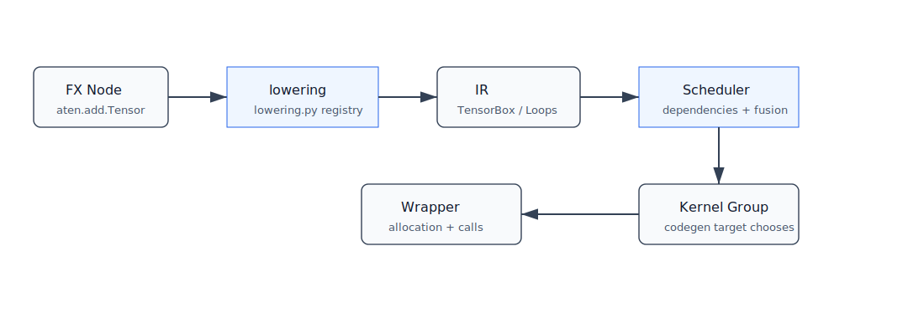

# 第 8 章：GraphLowering、IR、Buffer 与 Layout



## 本章目标

本章进入 Inductor 的核心内部：`GraphLowering` 如何把 FX Graph 转换成 Inductor IR。读完后你应该知道 `TensorBox`、`StorageBox`、`ComputedBuffer`、`Pointwise`、`Reduction`、`Layout` 这些名字大概代表什么。

## 背景知识

FX Graph 适合表达 PyTorch 算子级计算，但代码生成还需要更低层的信息：

- 输出 buffer 应该多大？
- stride 是什么？
- 这个值是 view 还是实际分配？
- 这个操作是 pointwise loop，还是 reduction loop？
- 中间结果是否必须 materialize？
- 输入输出在哪个 device 上？

这些信息由 Inductor IR 表达。

## 核心概念

### `GraphLowering`

本环境中 `torch/_inductor/graph.py` 定义：

```python
class GraphLowering(torch.fx.Interpreter):
```

它继承 FX Interpreter，说明它会解释 FX 节点。关键方法包括：

- `run`
- `call_function`
- `output`
- `codegen`
- `compile_to_module`

但它解释节点时，产物不是 eager Tensor，而是 Inductor IR 对象。

### `TensorBox` 与 `StorageBox`

`torch/_inductor/ir.py` 中有：

```text
class TensorBox
class StorageBox
```

可以先这样理解：

- `TensorBox` 是 Inductor 对“一个 tensor 值”的包装。
- `StorageBox` 管理这个值背后的存储表达。
- `TensorBox.realize()` 往往意味着把懒表达 materialize 成实际 buffer。

这种 box 设计让 Inductor 可以延迟决定是否真的分配中间结果。

### `ComputedBuffer`

`ComputedBuffer` 表示通过某段计算产生的 buffer。它通常会关联：

- layout。
- data，也就是 loop 表达。
- name。

如果 pointwise 链能融合，中间节点可能不会变成多个独立 `ComputedBuffer` 写回内存。

### `Pointwise` 与 `Reduction`

`ir.py` 里有：

```text
class Pointwise(Loops)
class Reduction(Loops)
```

它们都属于 loop 风格 IR。区别是：

- Pointwise：每个输出元素基本独立计算。
- Reduction：多个输入元素归约到较少输出元素，例如 sum、max。

### `Layout`

layout 描述 tensor 的形状、stride、device、dtype 等。常见类包括：

```text
FixedLayout
FlexibleLayout
```

layout 不是附属细节，它会影响索引表达、内存连续性、fusion 可行性和后端选择。

## 一个最小 PyTorch 示例

```python
import torch

def f(x):
    y = x + 1
    z = torch.relu(y)
    return z * 2

x = torch.randn(1024)
compiled_f = torch.compile(f)
compiled_f(x)
```

对这个例子，Inductor 可以把 `add -> relu -> mul` 表达成一个 pointwise loop。

## 编译前后发生了什么

从 FX 到 IR 的过程可以理解成：

```text
FX node: aten.add.Tensor
  -> lowering.py 查找 lowering
  -> 创建 Pointwise / TensorBox 等 IR

FX node: aten.relu.default
  -> lowering
  -> 继续包裹 pointwise 表达

FX output
  -> GraphLowering.output
  -> 标记 graph_outputs
```

GraphLowering 在解释过程中维护：

- `graph_inputs`
- `graph_outputs`
- `buffers`
- `operations`
- `constants`
- `device_types`
- `sizevars`

这些字段在后续 scheduler 和 wrapper codegen 中会继续使用。

## TorchInductor 内部大致发生了什么

对 pointwise 链，Inductor 倾向于保持懒表达：

```text
TensorBox(add)
  -> TensorBox(relu(add))
  -> TensorBox(mul(relu(add), 2))
```

只要没有必须实现的边界，Scheduler 可以把它们合成一个 kernel。必须 realize 的情况包括但不限于：

- 值被多个不兼容 consumer 使用。
- mutation 或 alias 语义需要保守处理。
- 后端限制要求 materialize。
- 输出需要稳定 layout。

## 关键源码入口

```text
/usr/local/lib/python3.11/site-packages/torch/_inductor/graph.py
/usr/local/lib/python3.11/site-packages/torch/_inductor/ir.py
/usr/local/lib/python3.11/site-packages/torch/_inductor/lowering.py
/usr/local/lib/python3.11/site-packages/torch/_inductor/virtualized.py
/usr/local/lib/python3.11/site-packages/torch/_inductor/sizevars.py
```

建议搜索：

```bash
rg -n "class GraphLowering|def call_function|def output" torch/_inductor/graph.py
rg -n "class TensorBox|class Pointwise|class Reduction|class ComputedBuffer" torch/_inductor/ir.py
```

## 常见误区

### IR 是另一种 FX Graph

不是。FX 是算子图；Inductor IR 更接近“如何生成循环和 buffer”的表示。

### layout 只是性能优化

layout 也关系正确性。stride、view、alias 和输出格式都需要正确处理。

### realize 一定不好

不一定。realize 可能增加内存写回，但有时能简化依赖、支持复用、满足后端要求。

## 小结

GraphLowering 是 Inductor 从图到内部世界的入口。它把 FX 节点 lowering 成 IR，并积累 buffer、operation、layout、shape 等信息。下一章看 Scheduler 如何使用这些 IR 决定 fusion 和代码生成顺序。

## 思考题或练习

1. 阅读 `ir.py` 中 `Pointwise` 和 `Reduction` 的类定义，比较它们字段差异。
2. 用 `x.transpose(0, 1)` 的例子思考 view 如何影响 layout。
3. 搜索 `realize()` 的调用点，观察哪些情况会强制 materialize。

## 本章需要人工核查的技术点

- IR 类字段经常调整，本章解释以概念为主。
- `TensorBox.realize()` 的触发条件复杂，应针对具体版本和具体图核查。

