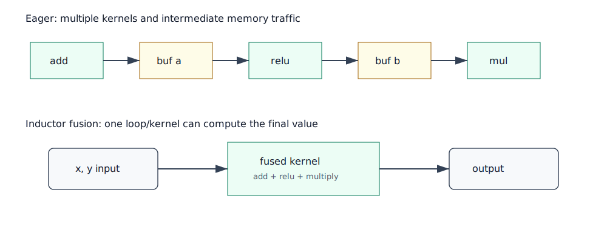

# 第 9 章：Scheduler、依赖分析与 Fusion



## 本章目标

本章解释 Inductor 如何从 IR 进入调度阶段：哪些节点能融合、按什么顺序生成代码、为什么有些看似简单的操作不能融合。

本章承接第 8 章的输出：

```text
GraphLowering.operations
  -> Scheduler(self.operations)
```

也就是说，Scheduler 不直接读 FX Graph。它读的是 GraphLowering 已经 lowering 出来的 Inductor IR operations。

## 背景知识

GraphLowering 产生 IR 后，Inductor 还没有生成代码。它需要先决定：

- 哪些 buffer 依赖哪些输入？
- 哪些计算可以放进同一个 kernel？
- 哪些必须先执行？
- 生成几个 kernel？
- 每个 kernel 的 iteration space 是什么？

这就是 Scheduler 的职责。

## 核心概念

### Scheduler 节点

本环境 `torch/_inductor/scheduler.py` 中有：

```text
class Scheduler
class SchedulerNode
class FusedSchedulerNode
class NopKernelSchedulerNode
class OutputNode
```

`SchedulerNode` 通常包装一个 IR operation；`FusedSchedulerNode` 表示多个节点融合后的调度单元。

源码定位：

```text
/usr/local/lib/python3.11/site-packages/torch/_inductor/scheduler.py
  class Scheduler: 约 1980 行
  create_scheduler_node: 约 2155 行
  fuse_nodes: 约 2574 行
  can_fuse: 约 3547 行
  codegen: 约 4149 行
  _codegen: 约 4204 行
```

`create_scheduler_node` 会根据 IR operation 类型创建不同调度节点：

```text
ir.ComputedBuffer / ir.TemplateBuffer -> SchedulerNode
ir.ExternKernel                         -> ExternKernelSchedulerNode
no-op operation                         -> NopKernelSchedulerNode
```

这一步是第 8 章 IR 和第 12 章 codegen 之间的适配层。

### 依赖分析

Scheduler 需要知道每个节点读写哪些 buffer。相关逻辑位于：

```text
torch/_inductor/dependencies.py
```

依赖分析回答：

- producer 是谁？
- consumer 是谁？
- 是否存在写后读、读后写、别名或 mutation 风险？
- 两个节点交换顺序是否安全？

在 `Scheduler.__init__` 中，依赖和排序相关步骤大致是：

```text
self.nodes = [self.create_scheduler_node(n) for n in nodes]
node.prune_deps()
compute_dependencies()
topological_sort_schedule()
dead_node_elimination()
compute_ancestors()
```

然后才进入 fusion、merge loops、memory reorder 等步骤。也就是说，fusion 不是在一堆无序节点上乱试，而是在依赖关系已经建立之后进行。

### Vertical fusion 与 horizontal fusion

可以用直觉区分：

- vertical fusion：生产者和消费者融合，例如 `add -> relu`。
- horizontal fusion：多个独立但形状相近的计算合并，例如两个并列 pointwise 输出。

源码中 `Scheduler` 有 `can_fuse_vertical`、`can_fuse_horizontal` 等判断。

### fusion 的收益估计

源码中存在 `speedup_by_fusion` 等逻辑。融合不是越多越好。融合可能带来：

- 更少 kernel launch。
- 更少中间内存访问。
- 更大 kernel，寄存器压力增加。
- 并行度变差。
- 代码生成复杂度上升。

源码中可以搜索：

```text
speedup_by_fusion
can_fuse_vertical
can_fuse_horizontal
```

读这些函数时不要只看“是否同 shape”。Inductor 还会考虑设备、后端能力、是否 template、是否 reduction、是否存在 mutation、是否会影响 memory ordering 等。

## 源码调用链解读

### 1. `GraphLowering.codegen` 创建 Scheduler

第 8 章末尾进入：

```text
GraphLowering.codegen
  -> self._update_scheduler()
  -> self.scheduler.codegen()
  -> self.wrapper_code.generate(...)
```

其中 `_update_scheduler()` 内部会构造：

```text
Scheduler(self.operations)
```

这就是本章入口。

### 2. `Scheduler.__init__` 先构建可调度世界

2.7.1 的 `Scheduler._init` 做了很多事，但第一遍可以按这条主线读：

```text
create SchedulerNode
compute dependencies
topological sort
dead node elimination
log IR before fusion
create foreach nodes
fuse nodes
merge loops
finalize multi-template buffers
memory reorder
compute last usage
log IR after fusion
```

注意这里出现了两个和调试很相关的时间点：

- pre-fusion IR。
- post-fusion IR。

打开 `TORCH_COMPILE_DEBUG=1` 或相关 artifact 日志时，看到的很多图和文本就对应这些阶段。

### 3. fusion 的结果仍然是 Scheduler node

fusion 不是直接生成 kernel 源码。fusion 的结果通常是把多个 `SchedulerNode` 包成 `FusedSchedulerNode`，或者把若干节点变成 foreach/combo/template 相关节点。

所以 Scheduler 的中间状态可以理解为：

```text
before fusion:
  [buf0(add), buf1(relu), buf2(mul)]

after fusion:
  [fused(buf0, buf1, buf2)]
```

真正生成 Triton/C++ 代码，还要等 `Scheduler.codegen()`。

### 4. `_codegen` 根据节点类型分派

`Scheduler._codegen` 是第 9 章通往第 12 章的桥。源码逻辑可以概括为：

```text
for node in nodes:
    enter_context(node)
    if device changes:
        flush backend and emit device guard

    if node.is_template():
        backend.codegen_template(...)
    elif node.is_extern():
        codegen_extern_call(...)
    elif node.is_foreach():
        backend.codegen_combo_kernel(...)
    elif node is SchedulerNode or FusedSchedulerNode:
        backend.codegen_node(node)
    else:
        mark no-op

    if backend.ready_to_flush():
        flush()
```

这段解释了为什么第 12 章要同时讲 wrapper、Triton、C++、extern call 和 template：Scheduler 会根据节点类型和 device 把不同节点送到不同后端。

### 5. `get_backend(device)` 决定 CPU/GPU codegen

Scheduler 内部会维护：

```text
self.backends: dict[torch.device, BaseScheduling]
```

不同 device 会得到不同 scheduling backend：

- CUDA/GPU 常见为 Triton/CUDA combined scheduling。
- CPU 常见为 CppScheduling。
- extern/template 节点可能走专门 codegen 路径。

读源码时遇到 `backend.codegen_node(node)`，下一步就应该跳到：

```text
torch/_inductor/codegen/triton.py
torch/_inductor/codegen/cpp.py
torch/_inductor/codegen/simd.py
```

## 一个最小 PyTorch 示例

```python
import torch

def f(x, y):
    a = x + y
    b = torch.relu(a)
    c = torch.sigmoid(b)
    return c * 3

x = torch.randn(1024, 1024, device="cuda")
y = torch.randn(1024, 1024, device="cuda")
torch.compile(f)(x, y)
```

这是典型 vertical fusion 场景。

一个更复杂的例子：

```python
def g(x, y):
    return (x + 1, y + 1)
```

这里可能涉及 horizontal fusion，具体取决于 shape、device、调度策略和版本。

## 编译前后发生了什么

Scheduler 大致流程：

```text
IR operations/buffers
  -> create SchedulerNode
  -> 计算 read/write dependency
  -> 尝试 fusion
  -> 排序
  -> 调用 backend scheduling.codegen()
```

贴近源码的版本：

```text
GraphLowering.codegen
  -> Scheduler(self.operations)
     -> create_scheduler_node
     -> compute_dependencies
     -> topological_sort_schedule
     -> fuse_nodes
     -> merge_loops
     -> reorder_for_peak_memory
     -> compute_last_usage
  -> Scheduler.codegen
     -> Scheduler._codegen
        -> backend.codegen_node / codegen_template / codegen_extern_call
```

GraphLowering 的 `codegen` 中会调用：

```text
self._update_scheduler()
self.scheduler.codegen()
self.wrapper_code.generate(...)
```

这说明 wrapper codegen 和 kernel codegen 是调度之后的事情。

## TorchInductor 内部大致发生了什么

对于：

```python
return torch.relu(x + y) * 2
```

可能形成一个融合节点。这个节点包含原本多个 pointwise 计算，在 GPU 上交给 `TritonScheduling` 生成 Triton kernel；在 CPU 上交给 `CppScheduling` 生成 C++ loop 或调用合适后端。

这也是为什么第 10 章的 lowering 和第 12 章的 codegen 不能分开理解：

```text
lowering 决定“这个 op 变成什么 IR”
scheduler 决定“哪些 IR 放在一起”
codegen 决定“这些 IR 用什么目标语言实现”
```

不能融合的常见原因：

- device 不同。
- dtype/layout 不兼容。
- reduction 和 pointwise 的 iteration space 不适合合并。
- mutation 或 alias 语义风险。
- 外部 kernel 边界，例如某些 matmul/conv/template。
- fusion 后估计收益不好。

## 关键源码入口

```text
/usr/local/lib/python3.11/site-packages/torch/_inductor/scheduler.py
/usr/local/lib/python3.11/site-packages/torch/_inductor/dependencies.py
/usr/local/lib/python3.11/site-packages/torch/_inductor/codegen/simd.py
/usr/local/lib/python3.11/site-packages/torch/_inductor/codegen/triton.py
/usr/local/lib/python3.11/site-packages/torch/_inductor/codegen/cpp.py
```

和上下章的连接：

```text
上一章 graph.py / ir.py:
  GraphLowering.operations

本章 scheduler.py:
  operations -> SchedulerNode -> FusedSchedulerNode -> backend dispatch

下一章 lowering.py:
  回头细看这些 operations 是如何由 pointwise/reduction lowering 生成的

第 12 章 codegen:
  backend.codegen_node(...) 生成 Triton/C++/wrapper
```

建议搜索：

```bash
rg -n "class Scheduler|def fuse_nodes|def can_fuse|def codegen" torch/_inductor/scheduler.py
rg -n "class ReadWrites|class MemoryDep" torch/_inductor/dependencies.py
```

## 常见误区

### 能融合就一定融合

不是。Scheduler 会考虑正确性和收益。

### fusion 只对 GPU 有意义

不是。CPU 上减少中间内存访问和循环开销同样有意义，只是收益模型和代码生成不同。

### fusion 后一定只有一个输出

不一定。融合 kernel 可以产生多个输出，但这会增加复杂性。

## 小结

Scheduler 是 Inductor 的决策中心之一。它把 IR 操作变成可生成代码的调度单元，并决定 fusion。下一章聚焦几个常见算子族：pointwise、reduction、softmax 等如何 lowering。

## 思考题或练习

1. 用 `TORCH_COMPILE_DEBUG=1` 查看 debug 目录中的 pre/post fusion 信息。
2. 尝试写一个返回两个 pointwise 输出的函数，观察生成 kernel 数量。
3. 搜索 `can_fuse_vertical`，阅读其中的限制条件。

## 本章需要人工核查的技术点

- fusion 规则和收益模型随版本变化很快。
- `INDUCTOR_POST_FUSION_SVG=1` 需要 Graphviz 支持，生成图行为依赖环境。
