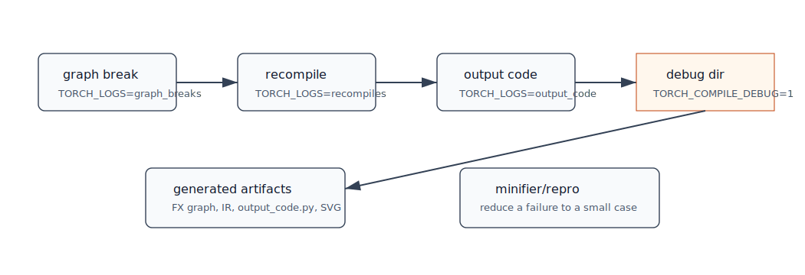

# 第 13 章：缓存、运行时、调试与源码阅读路线



## 本章目标

本章把工具书读者最需要的内容集中起来：如何看 graph break、recompile、生成代码、debug 目录、fusion 图、缓存，以及如何按调用链阅读源码。

## 背景知识

`torch.compile` 出问题时，常见问题分为四类：

- 没有编译起来：graph break 或 unsupported。
- 编译太多次：guard failure 或 shape 变化。
- 编译后结果不对：后端 bug、数值差异、mutation/view 问题。
- 编译后不快：fusion 不充分、fallback、多余 copy、autotune 未命中。

调试要先定位是哪一类。

## 核心调试命令

### 查看 graph break

```bash
TORCH_LOGS=graph_breaks python your_script.py
```

如果需要更多 Dynamo 细节：

```bash
TORCH_LOGS="+dynamo,graph_breaks" python your_script.py
```

### 查看重新编译

```bash
TORCH_LOGS=recompiles python your_script.py
```

常见原因：

- shape 变化。
- dtype/device 变化。
- stride/layout 变化。
- Python 对象或全局状态变化。

### 查看生成代码

```bash
TORCH_LOGS=output_code python your_script.py
```

本环境中 `torch/_logging/_registrations.py` 注册了 `output_code` artifact；`torch/_inductor/codecache.py` 和 `graph.py` 会把输出代码写入日志。

### 打开 debug 目录

```bash
TORCH_COMPILE_DEBUG=1 python your_script.py
```

指定目录：

```bash
TORCH_COMPILE_DEBUG=1 TORCH_COMPILE_DEBUG_DIR=/tmp/torch_compile_debug python your_script.py
```

本环境中：

- `torch/_inductor/config.py` 的 `trace.enabled` 由 `TORCH_COMPILE_DEBUG=1` 控制。
- `torch/_dynamo/config.py` 使用 `TORCH_COMPILE_DEBUG_DIR` 控制 debug 根目录。
- `torch/_inductor/debug.py` 的 `DebugContext` 创建 Inductor debug 子目录。

### 生成 post-fusion SVG

```bash
TORCH_COMPILE_DEBUG=1 INDUCTOR_POST_FUSION_SVG=1 python your_script.py
```

这依赖 Graphviz 的 `dot` 命令。源码中 `debug.py` 的 `draw_buffers` 会尝试生成图。

## 一个最小调试脚本

```python
import torch

def f(x):
    if x.shape[0] > 8:
        y = x + 1
    else:
        y = x - 1
    return torch.relu(y) * 2

compiled_f = torch.compile(f)

for n in [16, 16, 4, 32]:
    x = torch.randn(n, 128)
    y = compiled_f(x)
    print(n, y.shape)
```

运行：

```bash
TORCH_LOGS=recompiles,graph_breaks python debug_example.py
```

观察 shape 变化是否触发 recompile。

## 缓存与运行时

Inductor 有多层缓存概念：

- Dynamo code object cache：Dynamo 为 Python code object 缓存编译结果。
- FX graph cache：`compile_fx.py` 中通过 `FxGraphCache` 尝试复用 Inductor 编译结果。
- Code cache：`codecache.py` 管理生成代码写入、编译和加载。
- Autotune cache：保存算法选择/调优结果。
- Remote cache：部分环境可启用远程缓存。

不要把这些缓存混为一谈。定位性能时要问：

```text
是 Dynamo 重新捕获了？
是 Inductor FX graph cache miss？
是 kernel 重新编译？
是 autotune 又跑了一次？
```

## 源码阅读路线

建议按调用链阅读，而不是从 `torch/_inductor/` 第一个文件开始。

### 第一轮：跑通主线

```text
torch/__init__.py
  -> def compile
  -> _TorchCompileInductorWrapper

torch/_dynamo/eval_frame.py
torch/_dynamo/convert_frame.py
  -> Dynamo 捕获 frame

torch/_dynamo/backends/inductor.py
  -> backend 注册

torch/_inductor/compile_fx.py
  -> compile_fx
  -> compile_fx_inner
  -> _compile_fx_inner
  -> fx_codegen_and_compile

torch/_inductor/graph.py
  -> GraphLowering
  -> codegen
  -> compile_to_module
```

### 第二轮：理解 IR 和调度

```text
torch/_inductor/lowering.py
torch/_inductor/ir.py
torch/_inductor/dependencies.py
torch/_inductor/scheduler.py
```

### 第三轮：理解后端

```text
torch/_inductor/codegen/wrapper.py
torch/_inductor/codegen/triton.py
torch/_inductor/codegen/cpp.py
torch/_inductor/codegen/simd.py
torch/_inductor/async_compile.py
torch/_inductor/codecache.py
```

### 第四轮：理解大算子

```text
torch/_inductor/kernel/mm.py
torch/_inductor/kernel/bmm.py
torch/_inductor/kernel/conv.py
torch/_inductor/select_algorithm.py
torch/_inductor/codegen/cpp_gemm_template.py
```

### 第五轮：理解训练和边界场景

```text
torch/_functorch/aot_autograd.py
torch/_functorch/partitioners.py
torch/_functorch/_aot_autograd/
torch/_inductor/fx_passes/
torch/_inductor/runtime/
```

## 性能问题排查清单

1. 先确认有没有 graph break。
2. 再确认有没有频繁 recompile。
3. 查看 `output_code`，确认是否生成预期 kernel。
4. 看是否 fallback 到 ATen 或 extern kernel。
5. 看 pointwise 是否 fused。
6. 对 matmul/conv，检查是否启用合适 mode，例如 `max-autotune`。
7. 检查输入 shape 是否太小，编译收益无法摊薄。
8. 检查 layout/stride 是否导致额外 copy。
9. 对 GPU，确保 benchmark 时同步 CUDA。
10. 分开测 compile time、warmup 和 steady-state。

## 正确性问题排查清单

1. 先用 eager 输出作为基准。
2. 降低问题规模，保留 dtype/device/layout。
3. 尝试 `backend="eager"` 或 `backend="aot_eager"` 区分 Dynamo/AOT/Inductor 问题。
4. 尝试关闭部分 Inductor 配置，例如 fallback random、layout optimization 等，具体选项以 `torch._inductor.list_options()` 为准。
5. 使用 minifier 或 debug repro 生成最小复现。
6. 对训练问题，分别检查 forward 和 backward。

## 常见误区

### 只看终端报错就开始改模型

先开日志。graph break、guard failure、unsupported lowering 和 codegen failure 是不同问题。

### benchmark 不同步 CUDA

GPU 计时必须在计时前后 `torch.cuda.synchronize()`，否则测到的是调度时间。

### 看到 fallback 就认为失败

fallback 可能是正确性保护。真正要看它是否位于性能关键路径，以及是否打断 fusion。

## 小结

理解 Inductor 最有效的方法是：带一个小例子，打开日志，沿调用链读源码。主线是 `torch.compile -> Dynamo -> FX/AOTAutograd -> compile_fx -> GraphLowering -> Scheduler -> Codegen -> CodeCache/runtime`。遇到不懂的实现，不要猜，回到当前版本源码搜索。

## 思考题或练习

1. 用 `TORCH_LOGS=output_code` 找到一个 generated wrapper 的文件路径。
2. 用 `TORCH_COMPILE_DEBUG=1` 观察 debug 目录中有哪些文件。
3. 设计一个会 recompile 的 shape 变化例子，并用日志解释原因。
4. 找一个 matmul 例子，比较 `default` 和 `max-autotune` 的编译日志。

## 本章需要人工核查的技术点

- `TORCH_LOGS` 支持项可用 `TORCH_LOGS=help` 查询，版本间会变化。
- `TORCH_COMPILE_DEBUG` 目录结构不是稳定公共 API。
- minifier/repro 工具路径和参数应以当前版本源码为准。

